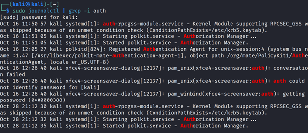
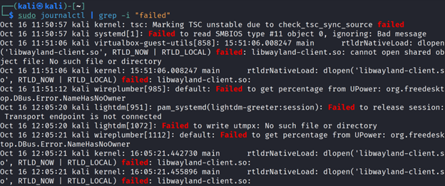
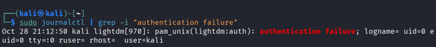

# Linux Authentication Log Analysis

## Objective
Understand how authentication failures are recorded on a Linux system and how to identify security-relevant log entries.

## Tools Used
- Kali Linux
- journalctl
- grep

## Steps Performed
1. Viewed system logs using jounralctl.
2. Filtered authentication-related entries.
3. Identified authentication failure events.
4. Differentiated between normal user behavior and suspicious activity.

## Observations
- Authentication logs were stored in the systemd journal rather than auth.log.
- Failed authentication attempts appeared as "authentication failure".
- Events originated from the local graphical login manager (lightdm).
- No evidence of brute-force or remote login attempts was observed.

## Conclusion
The observed authentication failures were consistent with normal user behavior (incorrect password entries) and did not indicate a security incident.

## Screenshots

### Authentication-related logs

### Failed events (including non-security noise)

### Authentication failure events

